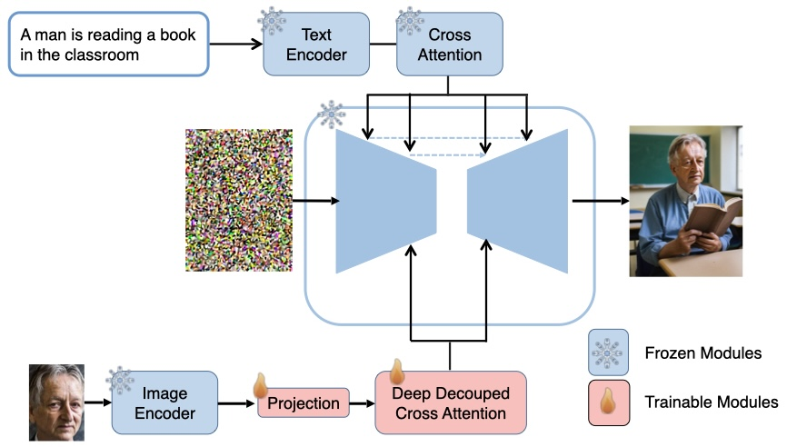

# ___Faster And More Efficient Subject Image Generation for Text-to-Image
Diffusion Models___

<a href='https://huggingface.co/YZBPXX/CCDA'></a>

---


## Introduction

 we present **Faster And More Efficient Subject Image Generation for Text-to-Image Diffusion Models**, we introduce a new topic-customized method that requires no repeated training. It trains a plugand-play image prompt adapter with only 417M parameters, lightweight yet powerful, surpassing existing models in both text and image consistency.




## Release
- [2024/5/1] 🔥 We release the code and models.

## Installation

```

git clone  https://github.com/YZBPXX/DDCA
cd DDCA

pip install -r requirements.txt
# download the models
git lfs install
git clone https://huggingface.co/YZBPXX/CCDA
```

## Download Models

you can download models from [here](https://huggingface.co/YZBPXX/CCDA).

## How to Use

### SDXL_1.0

- [**demo**](infer.ipynb): image generation with image prompt.

## How to Train
For training, you should install [accelerate](https://github.com/huggingface/accelerate) and make your own dataset into a pandas file.

```
bash train_sdxl.sh
```


